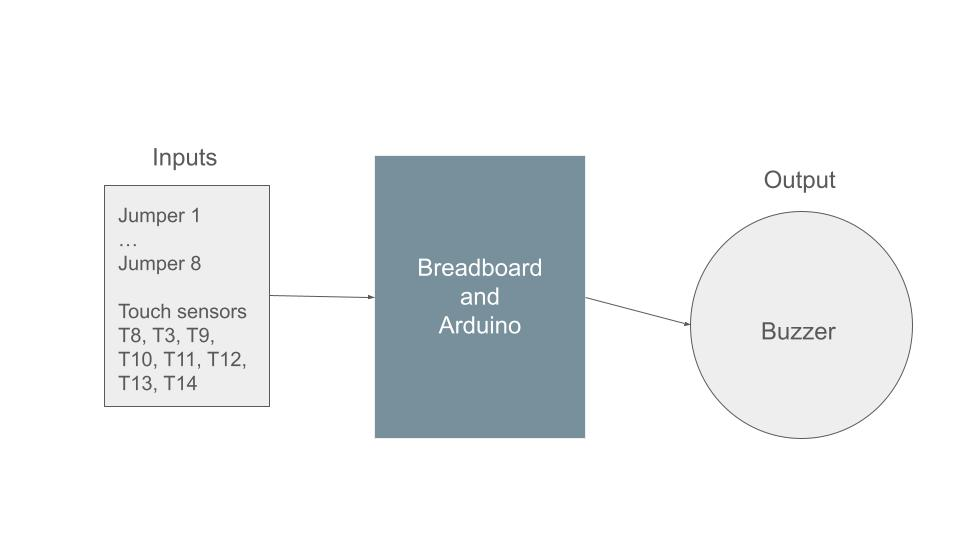
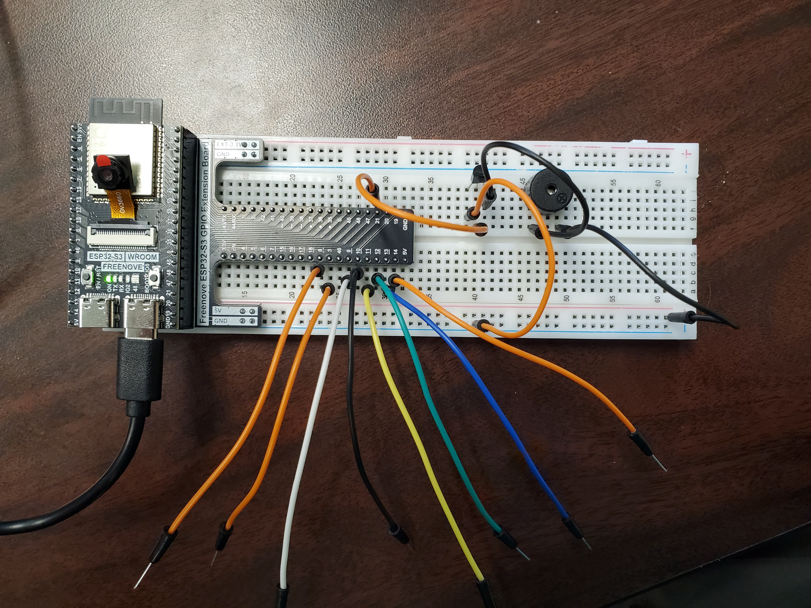
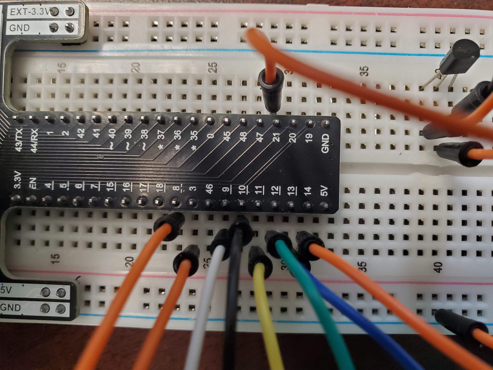

# Final Project

### Why did I do this
I thought that the touch sensor capabilities of the breadboard was really cool and I wanted to do something with it. When I learned that there was a speaker in the kit that could lay different frequencies based on the code, I knew I wanted to build a little piano. This is a fun little project for anyone who is into computers or tech as well as sound because it lets you begin to understand how computers take in signals and return frequencies.

### Overview Diagram

### What do you need?
- 12 Jumpers (preferably 7 or 8 different colors)
- A Passive Buzzer
- A NPN Transistor (S8050)
- An ESP32 Breadboard and Arduino IDE installed and running properly on your compute

### How to build it:

Keep in mind that you will need to space out your "key" jumpers and having them be different colors will help a lot. Also, the leftmost pin on the transistor is grounded, the middle pin is connected to channel 21, and the rightmost pin is connected to the buzzer. The other buzzer pin is powered on the 5V side of the breadboard.

The 8 "key" jumpers are on channels 8, 3, 9, 10, 11, 12, 13, and 14. They skip 46 as it has no touch sensor.

### Challenges and Interests in C
The most interesting part of this project (and the most frustrating) was that each channel required different touch threshholds which I had to find manually. However, after finding each individual threshhold I was able to pick a number that satisfied all of the threshholds to simplify the code. I also had to create a unique boolean condition for each channel so that they wouldn't cancel each other out. 

### My Code
To install the code yourself go to 
  [publication](https://github.com/milburnk-beep/KVM210FinalPiano.io/blob/main/ArduinoPiano.C)

Now I will briefly walk through how the code works:
**setup**
#define PIN_BUZZER 21
#define PRESS_VAL   180000    //Set a threshold to judge touch
#define RELEASE_VAL 75000     //Set a threshold to judge release
#define CHN 0

bool T8Touch = false;
bool T3Touch = false;
bool T9Touch = false;
bool T10Touch = false;
bool T11Touch = false;
bool T12Touch = false;
bool T13Touch = false;
bool T14Touch = false;
void setup() {
  Serial.begin(115200);
  pinMode(PIN_BUZZER, OUTPUT);
  ledcAttachChannel(PIN_BUZZER, 2000, 10, CHN);  //attach the led pin to pwm channel
  ledcWriteTone(PIN_BUZZER, 2000);        //Sound at 2KHz for 0.3 seconds
  delay(300);
}
This section defines the passive buzzer as the output, creates the channel that the buzzer will use, and creates boolean values for each channel on the breadboard so that when the code itself runs the different sensors won't cancel each other out.

**loop**
void loop() {
  if (touchRead(T8) > PRESS_VAL) {        //If the touch sensor at 8 reads a signal higher than Press_val, the buzzer will play C6
    if (!T8Touch) {                       //Checks to make sure that the touch sensor wasn't already activated
      T8Touch = true;
      Serial.println("C6");               //Prints the note in the serial monitor
      ledcWriteTone(PIN_BUZZER, 1046.5);
      delay(10);
    }
  }
  if (touchRead(T8) < RELEASE_VAL) {      //Upon release, stops playing note
    if (T8Touch) {
      T8Touch = false;
      ledcWriteTone(PIN_BUZZER, 0);
    }
  }

This is only the first chunk of the loop. The other 7 channels use the exact same code, just with different frequency outputs and jumper inputs. The way that this works is that upon sensing a touch, if the condition is not already true, the buzzer will sound at the given frequency (in this case playing the note C6) and return what the note is in the Serial Monitor. When the channel senses a touch value less than the release value it and the condition is not already false it will turn the buzzer off
